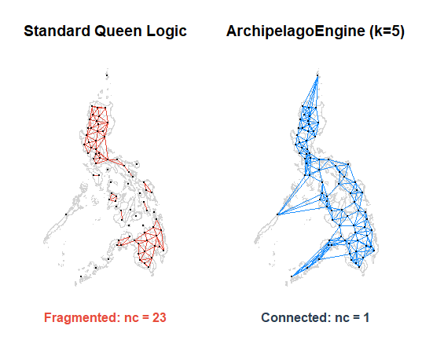
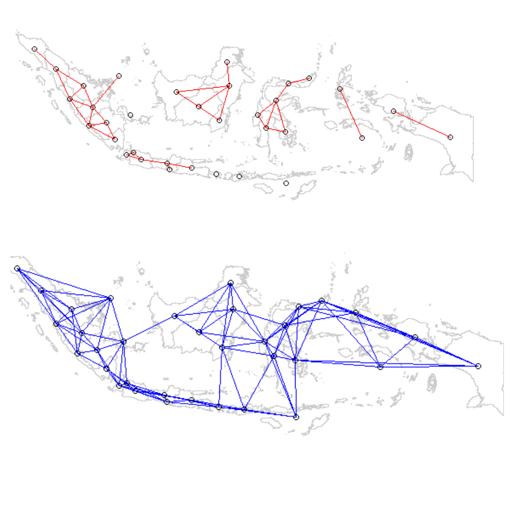
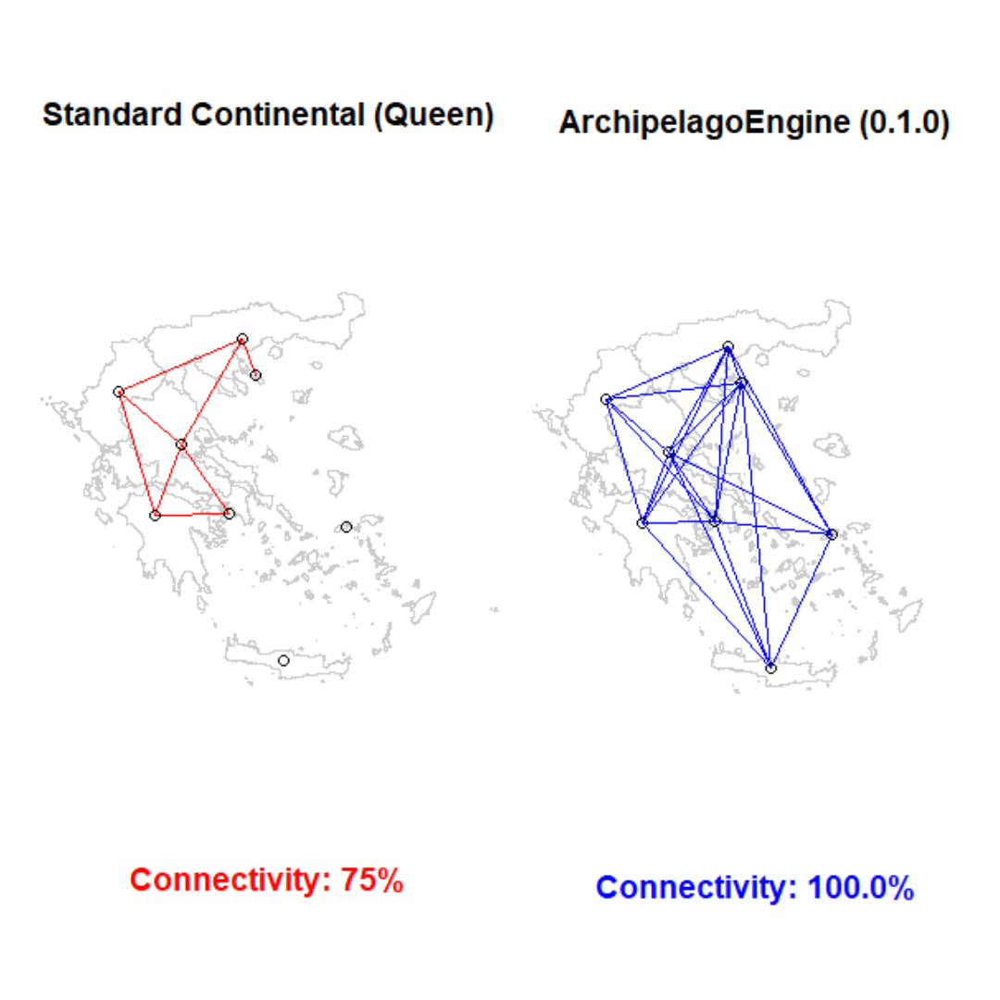

# ArchipelagoEngine: Spatial Weight Construction for Archipelagic Topographies 

[](https://CRAN.R-project.org/package=ArchipelagoEngine)
[](https://github.com/njtalingting/ArchipelagoEngine/actions/workflows/R-CMD-check.yaml)
[](https://codecov.io/gh/njtalingting/ArchipelagoEngine)
[](https://rweekly.org/2026-W12.html)

## Overview
Standard spatial contiguity models often leave significant portions of island nations mathematically isolated. In the Philippine context, standard Queen logic leaves about 20% of Philippine provinces orphaned, resulting in a fragmented network with only approximately 72% connectivity. This fragmentation introduces systematic predictive bias and significant residual spatial autocorrelation (e.g., Moran's I=0.024, p<0.05 for 'palay' price in the Philippines).

`ArchipelagoEngine` implements specialized K-Nearest Neighbor (KNN) logic to bridge these fragmented maritime networks. By enforcing a unified grid (optimized at k=5 using the Philippines as case study), the engine achieves 100% network connectivity and neutralizes spatial bias, enabling robust econometric inference for fragmented geographies.

## Key Features
<p align="center">
  
  <br>
  <b>Figure 1:</b> <i>Standard Queen Logic (Left) vs. ArchipelagoEngine k=5 (Right)</i>
</p>

* **100% Connectivity via Sparse Matrix Topology:** Ensures no island units are mathematically isolated by constructing a regular network graph. This guarantees 100% connectivity while preserving matrix sparsity and preventing global noise.

* **Automates a `listw` object:** Can be directly feed for spatial regression modeling functions from packages like `spatialreg` or `splm`.

* **Built-In Geographic Data Environment:** Ships with a pre-loaded, cleaned `raw_data` shapefile of the Philippines, mapped to GADM standards.

* **Neutralizes Spatial Bias:** Reduces Global Moran's I to neutralize significant residual spatial autocorrelation.
  
## Installation

```R
install.packages("ArchipelagoEngine")
```
## Quick Start
The core function, `build_archipelago_weight`, bridges fragmented networks using optimized KNN logic.
```R
library(ArchipelagoEngine)
library(sf)
library(spdep)

# Load the benchmark map
data(raw_data)

# NOTE: This is a proposed structural baseline that mimics latent maritime infrastructure. 
# You can and should change the k parameter to fit the specific needs, bounds, and theory of your own research.
weights <- build_archipelago_weight(raw_data, k = 5)

# Scans the graph to see if any islands are isolated
# If this returns 1, the computer has verified 100% connectivity
connectivity_status <- spdep::n.comp.nb(weights$neighbours)$nc
print(connectivity_status)

# Plot connectivity
plot(st_geometry(raw_data), border = "lightgrey")
plot(weights$neighbours, st_coordinates(st_centroid(raw_data)), 
     add = TRUE, col = "#1E90FF", pch = 19, cex = 0.5, lwd = 0.7)

# Result status
mtext(paste("Status: 100% Connectivity Achieved (nc =", connectivity_status, ")"), 
      side = 1, line = 1, adj = 0.5, cex = 0.9, font = 1, col = "#2C3E50")
```
## Further Research
The package can be scaled to other island nations that face similar error during their analysis:

<p align="center">
  
  <br>
  <b>Figure 2:</b> <i>Standard Queen Logic (Top) vs. ArchipelagoEngine k=5 (Bottom)</i>
</p>

<p align="center">
  
  <br>
  <b>Figure 3:</b> <i>Standard Queen Logic (Left) vs. ArchipelagoEngine k=5 (Right)</i>
</p>

## Limitations & Recommendations
A key limitation of `ArchipelagoEngine` is its reliance on spatial proximity, which may force arbitrary topological connections between islands that lack real-world functional interaction. While this geometric abstraction is an inherent trade-off of the model, integrating transport data — such as the Roll-on/Roll-off (RoRo) networks in the `roroph` package — offers a more realistic representation of maritime connectivity. 

However, researchers must note that RoRo networks can be endogenous to the system, shaped by the very internal economic or geographic factors the model seeks to analyze. Thus, supplementary tests such as Instrumental Variables (IV) must be conducted to control for this potential endogeneity.

## Acknowledgment
The development of `ArchipelagoEngine` is guided by the `#rspatial` community to ensure it meets the rigorous standards of spatial econometrics:

* **Roger Bivand**: For the foundational recommendation to integrate this engine with the broader R-spatial ecosystem (specifically `sfislands` and `spdep`).
* **Barry Rowlingson**: For the inspiration to bridge pure geometric adjacency with real-world transport logic, hence the creation of the `roroph` package.

## References
Anselin, L. (1988). *Spatial Econometrics: Methods and Models*.

LeSage, J., & Pace, R. K. (2009). *Introduction to Spatial Econometrics*. 

Bivand, R. S., & Wong, D. W. (2018). "Comparing methods for isolating units of spatial autocorrelation." *Geographical Analysis*.
